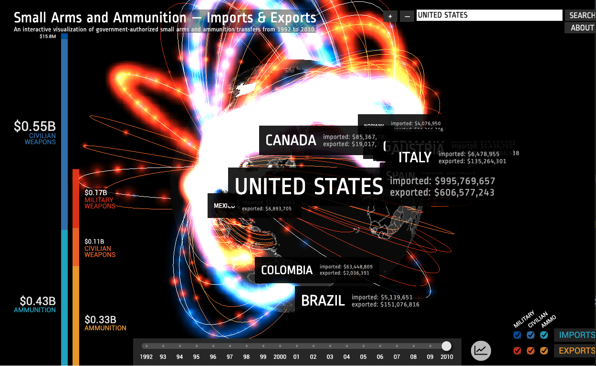
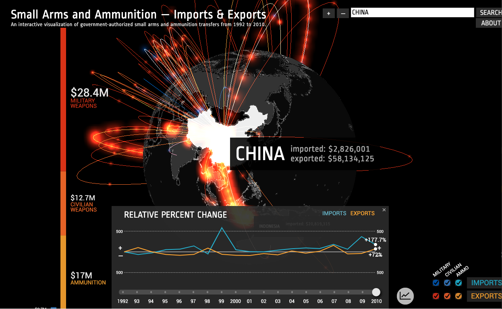

#### THREE-BI系统介绍

一个基于THREE开发的交互式报表系统, 支持ThreeJS版本105, 这是一个基于地球分布的销售交互系统，可以用于开发类似项目的模版使用。





#### 更新日志

7、Rotating的遍历改为新版THREE的方式

6、修改 getVisualizedMesh 中粒子实现的方法，改为由 THREE.Geometry()改为 THREE.BufferGeometry

5、整理JS代码，变量传递统一改为 dataObject 对象

4、把HTML的Shader移到了JS中，避免HTML内容看起来不舒服

3、工程化考虑，把项目工程改为由打包工具Parcel打包的工程，没有使用WebPack，感觉比较繁琐。但是Pacel打包要把资源文件拷贝到打包目标目录下，不过还能接受吧！

2、由于原来的版本比较老了，是2012年开发的，那时ThreeJS版本也比较老，好像是49版本，而现在Three版本已经到了107版本，所以需要修改以适应新的版本需要。

1、这是从一个类似的项目工程基础上修改更新而来，首先向原创者致敬！

#### 安装使用

1、克隆本项目
```javascript
git clone https://github.com/enigmawxy/three-bi.git
```

2、依次运行如下命令：
```js
npm install
```

3、把json，images目录拷贝到 dist 目录下


4、启动
```js
npm start
```
